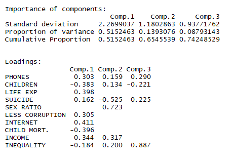

#I. Introduction:
The project was done at Texas Tech University during the Multivariate Analysis class. The dataset is used from Gapminder World, which contains data from several sources. It contains information from different indicators about the population for each country. The motivation is focused on comparing countries from the economical, social and government perspectives. Full list of variables and their sources can be found at the bottom of this page in the Appendix.
<br/>


#II. Data Cleaning and Outlier Visualization:
It is believed that outliers in data set contain valuable information and should not be deleted. In order to fix mising values, function was made which replace NA values by median value for the continent.
In order to see the whole proces of merging and cleaning data see the function on the github [github](https://github.com/grzechowiak/Multivariate-Analysis-Project/blob/master/Read_Clean.R)

```{r message=FALSE, warning=FALSE, paged.print=FALSE,dpi=300, fig.width=20,fig.height=11}
library(readr)
library(readxl)
library(dplyr)
library(countrycode)
library(car)
source('Read_Clean.R')
cleaned <- Read_Clean()
```
*image_caption*


#III. Visualizations

## A. Dimension Reduction

#### Multidimensional Scaling (MDS)

In order to provide a general insignis into the data, all countries were presented in 3-dimensional space. At the first glance clusters between continents can be seen. Countries which are in the same continent in general present a similar profile. The code can be found here [github](https://github.com/grzechowiak/Multivariate-Analysis-Project/blob/master/MDS.R)

```{r message=FALSE, warning=FALSE, paged.print=FALSE, include=FALSE}
library(scatterplot3d)
# source('MDS.R')
```


##### Principal Components Analysis
Code for PCA can be found here [github](https://github.com/grzechowiak/Multivariate-Analysis-Project/blob/master/PCA.R)

```{r fig.height=10, fig.width=15, message=FALSE, warning=FALSE, dpi=300, include=FALSE}
library(maptools)
library(pryr)
library(ggbiplot) 
#library(devtools)
#install_github("vqv/ggbiplot")
source('PCA.R')
PrinCompPlot <- PCA(cleaned)
```

Interpretation of PC1, PC2, and PC3 is as follows:<br/>
PC1: highly loaded in variables such as number of phones, life expectancy, Corruption index, Acces to the Internet and Income.<br/>
PC2: highly loaded in the number of suicides and sex ratio. <br/>
PC3: especially meaningful in the context of inequality.




*Plot PC1 vs PC2* 

```{r fig.height=10, fig.width=15, message=FALSE, warning=FALSE, dpi=300}
PrinCompPlot[1]
```

<br/>
-On the right of the plot with a high value of PC1 high developed countries in Europe and North America can be spotted. Those contents are above the average in the context of Less corruption, Life expectancy, Internet access, number of phones and income.

<br/>

- On the left side of the plot, with a low value of PC1 not less developed countries in Africa can be spotted. Those countries are above the average in the context of high child mortality, a number of children per woman and inequality.

<br/>

- Interesting phenomena is presented by looking at Asia. The continent is the most diverse among all of the others in both directions PC1 and PC2. Some countries in Asia are highly developed while others are rather poor (PC1). In the context of PC2, some countries have extreme value for sex ratio (men outnumber women significantly). Those countries are Qatar and the UAE.


*Plot PC1 vs PC3* 

```{r fig.height=10, fig.width=15, message=FALSE, warning=FALSE, dpi=300}
PrinCompPlot[2]
```

<br/>
The second plot shows that very high inequality is presented especially in South America and Africa
<br/>
A high correlation between variables: number of phones, less corruption, Internet access and income. Another group of highly correlated variables are child mortality and a number of children per woman.  


*PCA on the World Map* 
<br/>
In order to show which countries are the highest in what Principal Component the World Map was presented. From each component (PC1, PC2, and PC3) top 15 countries with the highest loading in each group were chosen and plotted on the map.

```{r fig.height=10, fig.width=15, message=FALSE, warning=FALSE, dpi=300}
PrinCompPlot <- PCA(cleaned)
```

Note: from the analysis columns such as Population total, number of murder, number of armed forces, urban population total and percentage of investments are excluded. Those variables had a low correlation with the rest of the columns and much more dimensions would be needed to explain the data. As such information would not be possible to be explained in 2-dimensional plot.


## B. Cluster Analysis

####Hierarchical Clustering between Continents
The hierarchical clustering model explains that the data has two main clusters.  Looking at the model the first cluster includes Africa, Oceania, Asia & Central America and the second includes South America, Europe, North America. Interesingly Oceania is not clustered with highly developed countries despite the continent contains highly developed countries such as Australia and New Zeland.

[Code](https://github.com/grzechowiak/Multivariate-Analysis-Project/blob/master/cluster_continents.R)
```{r message=FALSE, warning=FALSE, paged.print=FALSE, dpi=300, fig.width=11,fig.height=7}
library(ape)
source('cluster_continents.R')
Cl_continents <- cluster_continents(cleaned)
```


####K-means and Model-Based clustering between Conutries
[Code](https://github.com/grzechowiak/Multivariate-Analysis-Project/blob/master/clusters_countries.R)
```{r fig.height=10, fig.width=15, message=FALSE, warning=FALSE, dpi=300}
library(mclust)
source('clusters_countries.R')
Cl_countries <- clusters_countries(cleaned)
```

- compare chi.square test -> dependency between groups and continents. Model based groups are more similar to continents.

- model based (group7) difficult name (result for this group)
pop_total murder_pp armed_pp phones_p100 children_p_woman life_exp_yrs suicide_pp urban_pop_tot sex_ratio_p100
[1,] 239114394         0    0.011     146.317             2.07       78.053          0     118882678        148.681
     corruption_CPI internet_%of_pop child_mort_p1000 income_per_person investments_per_ofGDP   gini
[1,]         53.677           75.725           10.791          50579.31                29.942 39.722

- Developed countries are split into 3 groups.

- poor countries are the same in both models

- we lost "crowded" group from k-means. It transfoms into group 7 which describe high Income, Sex Ratio, Population, phones


# V. Exploratory Factor Analysis -MIKA
In order to find the number of factors, EFA was performed starting with 1 factor, increasing the number of factors until getting a value for RMSE lower than 0.05. Therefore, it was concluded that the optimal number of factors is four. Performing EFA with 4 factors, the loadings are:    

```{r fig.height=10, fig.width=15, message=FALSE, warning=FALSE, dpi=300}
  
#PART 5: EFA
source('EFA.R')
EFA_loadings(cleaned)
```
From the loadings it can be interpreted:  
<br/>
-1.	Factor 1 has high life expectancy, internet access, balanced income per person and it is low in child mortality and children per women. For these reasons, represents the level of development of the country.
<br/>
-2.	Factor 2 represents the level of population.
<br/>
-3.	Factor 3 represents inequality and murder.
<br/>
-4.	Factor 4 represents the level of income related with the amount of men and women that the country has. 
In order to visualize these four factors graphically, the top 10 for each factor’s scores was taken and create four groups of countries, where each factor has more relevance. The groups of countries are named according with the meaning of each factor as follows: 
<br/>
-Factor 1 -> Developed <br/>
-Factor 2 -> Crowed  <br/>
-Factor 3 -> Inequality <br/>
-Factor 4 -> Gender/Income  <br/>
These can be visualized in the following graph: <br/>


```{r fig.height=10, fig.width=15, message=FALSE, warning=FALSE, dpi=300}
source('EFA.R')
groups = EFA_plot(cleaned)
```

Note: There are some countries such as Singapore or Qatar that are in the groups but are too small to show in the map.


#VI. Confirmatory Factor Analysis -> Mika put links
```{r}
#PART 6: CFA
#???????
```


#VII. Conclusion ->
<!-- Team presented meaningful findings and discussed the pros and cons of their study. Team suggested some future works for post analysis. -->

Because of big differences


#VIII. Appendix

.png)