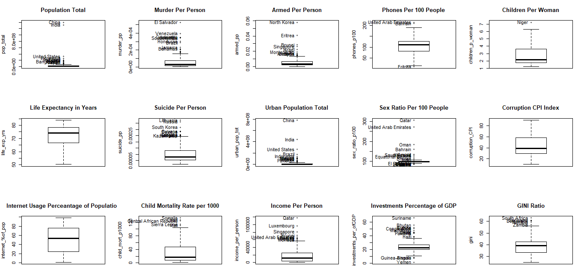

#I. Introduction: ROGELIO
<!-- Team clearly described the dataset and clearly described the motivation behind studying the data. Team provided -->
<!-- scholarly citations or quantitative facts to describe the motivation. -->
Dataset:
The dataset is used from Gapminder World, which contains data from several sources. It contains information from different indicators about the population for each country. 
The indicators considered for this study are Population Total, Murder Total, Armed Forces Personnel Total, Cell Phones per 100 People, Fertility Rate Total, Urban Population, Suicide Total, Life Expectancy, Corruption Perception Index, Internet Users (% of Population), Child Mortality, Income Per Person, Sex Ratio, Investment(as % of GDP), and Inequality Index(GINI). For more information about the indicators see the appendix of the report.
All indicators’ values come from the year 2016. The only exception is Sex Ratio. We assume that sex ratio did not change significantly between 2015 and 2016, and using data from 2015 is a good approximation of year 2016.
<br/>

Motivation:
Our motivation is focused on comparing countries from the economical, social and government perspectives. This study can be useful for many people. For instance, for a person that wants to move to another country, it might be important to consider these aspects to make the decision. In addition, it could be useful for the World Health Organization when determining which countries it should support in each field. Finally, firms that want to open an office in another country might be interested in this data as careful considerations are made when making such a large business decision.
<br/>
#II. Data Cleaning and Outlier Visualization: ROGELIO
<!-- Team clearly described their data cleaning and outlier removal process. Team presented insightful visualizations -->
<!-- motivating to do further exploratory or confirmatory analysis. -->

In this section, the process of data cleaning and identifying outliers is described. After importing the data from multiple csv files, the next process was to merge the columns on the country and by the year(2016).  Once the merging process was complete, a function was found that would divide the countries by the continent they belong in order to create a new column called “continent.”  Unfortunately, the function did not divide the Americas into North, South, and Central so a for loop was created to iterate through the countries column in order to place them into a more specific part of the Americas.  The reason for the new column “continent” was to account for missing values in our data.  If an NA value was spotted it would insert the median value depending on the continent associated with the country that had the missing value.  Outliers are present in the data and boxplots were created in order to visualize which countries were outliers according to the indicator. Outliers were not removed because in this case the outlier values were not the results of an error, but instead were actual datapoints. If the outliers were removed, the potential to lose meaning and value from the data would increase greatly. The reason is an outlier would be associated with a country and in order to remove the outlier we would have to delete an entire row.
<br/>

In order to get insights about outliers, five columns were presented on boxplots below. Please find all boxplots for each column in the Appendix.
```{r message=FALSE, warning=FALSE, paged.print=FALSE,dpi=300, fig.width=20,fig.height=11}
#PART 1: Read csv, merge, clean and plot outliers.
library(readr)
library(readxl)
library(dplyr)
library(countrycode)
library(car)
source('Read_Clean.R')
cleaned <- Read_Clean()
```


#III. Dimension Reduction Analysis: MIKA & ME
<!-- Team applied dimension reduction analysis correctly and discussed the -->
<!-- motivation behind that. Also, they provided interesting insights into the -->
<!-- results. -->

The data set contains 17 variables. In order to easly present them, dimension reduction analysis were computed. Two techniques were used: Multidimensional Scaling (MDS) and Principal Component Analysis (PCA).


####Part A: Multidimensional Scaling (MDS)

In order to provide a general insignis into the data, all countries were presented in 3-dimensional space. At the first glance clusters between continents can be seen. Countries which are in the same continent in general present a similar profile. The most diverse continent is Asia with many outliers. Countries in Asia spread from Europe (the one end) and Africa (the second end). It can be seen that North America and South America are similar to each other.

```{r message=FALSE, warning=FALSE, paged.print=FALSE, include=FALSE}
library(scatterplot3d)
# source('MDS.R')
```


#####Part B: Principal Components

```{r fig.height=10, fig.width=15, message=FALSE, warning=FALSE, dpi=300, include=FALSE}
library(maptools)
library(pryr)
library(ggbiplot) #if the library is not present use the code below
#library(devtools)
#install_github("vqv/ggbiplot")
source('PCA.R')
PrinCompPlot <- PCA(cleaned)
```

The Principal Component Analysis (PCA) was used in order to provide insights into the data and visualize it in two-dimensional plots. Three principal components were presented on the plots below and their cumulative proportion of variance is 74%.
<br/>

Interpretation of PC1, PC2, and PC3 is as follows:<br/>
PC1: is highly loaded in variables such as number of phones, life expectancy, Corruption index, Acces to the Internet and Income.<br/>
PC2: is highly loaded in the number of suicides and sex ratio. <br/>
PC3: is especially meaningful in the context of inequality.


In order to present the PCA result, two graphs were displayed below. Ellipses were added to the graphs which shows a concentration of points. Ther size is influenced by outliers. <br/>
<br/>

*Plot PC1 vs PC2* 
<br/>
-On the right of the plot with a high value of PC1 hight developed countries in Europe and North America can be spotted. Those contents are above the average in the context of Less corruption, Life expectancy, Internet access, number of phones and income.

<br/>

- On the left side of the plot, with a low value of PC1 not less developed countries in Africa can be spotted. Those countries are above the average in the context of high child mortality, a number of children per woman and inequality.

<br/>

- Interesting phenomena is presented by looking at Asia. The continent is the most diverse among all of the others in both directions PC1 and PC2. Some countries in Asia are highly developed while others are rather poor (PC1). In the context of PC2, some countries have extreme value for sex ratio (men outnumber women significantly). Those countries are Qatar and the UAE.

<br/>

- PC1 and PC2 do not give us many insights into Central America nor South America. Since values for these continents are in the middle of the plot.

```{r fig.height=10, fig.width=15, message=FALSE, warning=FALSE, dpi=300}
PrinCompPlot[1]
```

*Plot PC1 vs PC3* 
<br/>
The second plot shows that very high inequality is presented especially in South America and Africa
<br/>
The above plots show also that there is a high correlation between variables: number of phones, less corruption, Internet access and income. Another group of highly correlated variables are child mortality and a number of children per woman.  

```{r fig.height=10, fig.width=15, message=FALSE, warning=FALSE, dpi=300}
PrinCompPlot[2]
```

*PCA on the World Map* 
<br/>
In order to show which countries are the highest in what Principal Component the World Map was presented. From each component (PC1, PC2, and PC3) top 15 countries with the highest loading in each group were chosen and plotted on the map.

```{r fig.height=10, fig.width=15, message=FALSE, warning=FALSE, dpi=300}
PrinCompPlot <- PCA(cleaned)
```

Note: from the analysis columns such as Population total, number of murder, number of armed forces, urban population total and percentage of investments are excluded. Those variables had a low correlation with the rest of the columns and much more dimensions would be needed to explain the data. As such information would not be possible to be explained in 2-dimensional plot.


#IV. CLUSTERING - ROGELIO
#### PART A: Hierarchical Clustering between Continents
The hierarchical clustering model explains that the data has two main clusters.  Looking at the model the first cluster includes Africa, Oceania, Asia & Central America and the second includes South America, Europe, North America. What is interesting about this clustering is that Africa is clustered with Oceania which includes Australia and New Zealand.  The reason this is interesting is the fact that Australia and New Zealand are considered highly developed, but they are grouped with the entire African continent.  This is more than likely due to the reason that Oceania also has many small islands included in the continent that are not as developed which causes the grouping with Africa.
```{r message=FALSE, warning=FALSE, paged.print=FALSE, dpi=300, fig.width=11,fig.height=7}
# PART 3: Hierarchical Clustering between Continents
library(ape)
source('cluster_continents.R')
Cl_continents <- cluster_continents(cleaned)
```


#### PART B: K-means and Model-Based clustering between Conutries
Jereamy both
```{r fig.height=10, fig.width=15, message=FALSE, warning=FALSE, dpi=300}
# PART 4: K-means & Model Based Clustering between Countries
library(mclust)
source('clusters_countries.R')
Cl_countries <- clusters_countries(cleaned)
```

- compare chi.square test -> dependency between groups and continents. Model based groups are more similar to continents.

- model based (group7) difficult name (result for this group)
pop_total murder_pp armed_pp phones_p100 children_p_woman life_exp_yrs suicide_pp urban_pop_tot sex_ratio_p100
[1,] 239114394         0    0.011     146.317             2.07       78.053          0     118882678        148.681
     corruption_CPI internet_%of_pop child_mort_p1000 income_per_person investments_per_ofGDP   gini
[1,]         53.677           75.725           10.791          50579.31                29.942 39.722

- Developed countries are split into 3 groups.

- poor countries are the same in both models

- we lost "crowded" group from k-means. It transfoms into group 7 which describe high Income, Sex Ratio, Population, phones


# V. Exploratory Factor Analysis -MIKA
In order to find the number of factors, EFA was performed starting with 1 factor, increasing the number of factors until getting a value for RMSE lower than 0.05. Therefore, it was concluded that the optimal number of factors is four. Performing EFA with 4 factors, the loadings are:    

```{r fig.height=10, fig.width=15, message=FALSE, warning=FALSE, dpi=300}
  
#PART 5: EFA
source('EFA.R')
EFA_loadings(cleaned)
```
From the loadings it can be interpreted:  
<br/>
-1.	Factor 1 has high life expectancy, internet access, balanced income per person and it is low in child mortality and children per women. For these reasons, represents the level of development of the country.
<br/>
-2.	Factor 2 represents the level of population.
<br/>
-3.	Factor 3 represents inequality and murder.
<br/>
-4.	Factor 4 represents the level of income related with the amount of men and women that the country has. 
In order to visualize these four factors graphically, the top 10 for each factor’s scores was taken and create four groups of countries, where each factor has more relevance. The groups of countries are named according with the meaning of each factor as follows: 
<br/>
-Factor 1 -> Developed <br/>
-Factor 2 -> Crowed  <br/>
-Factor 3 -> Inequality <br/>
-Factor 4 -> Gender/Income  <br/>
These can be visualized in the following graph: <br/>


```{r fig.height=10, fig.width=15, message=FALSE, warning=FALSE, dpi=300}
source('EFA.R')
groups = EFA_plot(cleaned)
```

Note: There are some countries such as Singapore or Qatar that are in the groups but are too small to show in the map. 
<br/>
<br/>
The countries in group 1 are:  

```{r fig.height=10, fig.width=15, message=FALSE, warning=FALSE, dpi=300, , results='asis'}
library(knitr)
print(groups[1])
```

The countries in group 2 are:  

```{r fig.height=10, fig.width=15, message=FALSE, warning=FALSE, dpi=300, , results='asis'}
library(knitr)
print(groups[2])
```


The countries in group 3 are:  

```{r fig.height=10, fig.width=15, message=FALSE, warning=FALSE, dpi=300, , results='asis'}
library(knitr)
print(groups[3])
```

The countries in group 4 are:  

```{r fig.height=10, fig.width=15, message=FALSE, warning=FALSE, dpi=300, , results='asis'}
library(knitr)
print(groups[4])
```

#VI. Confirmatory Factor Analysis -> Mika put links
```{r}
#PART 6: CFA
#???????
```


#VII. Conclusion ->
<!-- Team presented meaningful findings and discussed the pros and cons of their study. Team suggested some future works for post analysis. -->

Because of big differences


#VIII. Appendix

